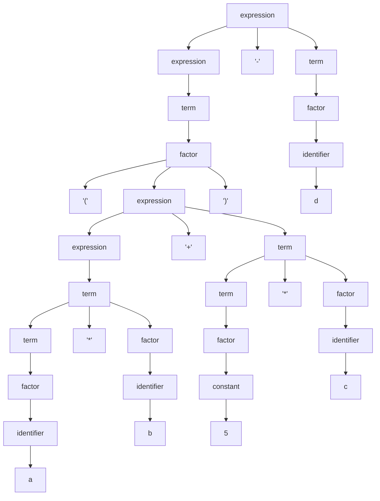
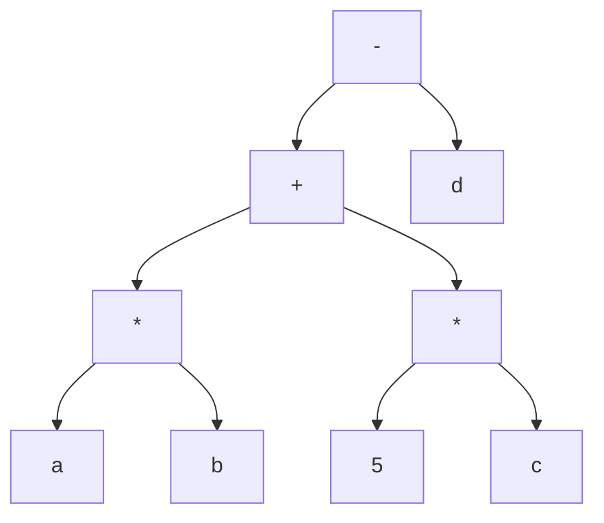

# LP Quiz 2

## 1. What are the compiler components?

The front-end and back-end.

## 2. Briefly explain each component of the compilers?

front-end: Analize the program text and convert it to AST.
back-end: Generate executable code for a target machine from the AST.

## 3. For the following grammar what is the parse tree of the expression `(a*b+5*c)-d`



## 4. Refer to the above grammar, what is the abstract syntax tree AST for the expression `(a*b+5*c)-d`?



## 5. What is the advantage of using the compiler's front-end and back-end?

- Easy retargeting by reusing the front-end.
- Easy optimization by reusing the back-end.

## 6. Suppose you want to write 4 compilers for 5 computer platforms, how many programs you need to write?

9

## 7. For the regular expression `((0|1)0(0|1))*` give 3 accepted strings of this regular expression?

- λ
- 000
- 101

## 8. Write a program (in C/C++ or Java) that translates infix expression into its	prefix equivalent.

In C.

```C
#include <ctype.h>
#include <stdio.h>
#include <stdlib.h>
#include <string.h>

#define MAX_N_TOKEN (256)

typedef enum {
  TERM, // The terminal symbol or unknown
  NUMBER,
  OPEN_PAREN,
  CLOSE_PAREN,
  PLUS,
  MINUS,
  TIMES,
  DIVISION,
} type_t;

typedef struct {
  type_t type;
  int num;
} token_t;

char c;

void next() {
  do {
    c = getchar();
  } while (c == ' ' || c == '\n' || c == '\r');
}

char peek() { return c; }

int toint(char c) { return c - '0'; }

int scanNumber() {
  int ret = 0;
  while (isdigit(peek())) {
    ret = ret * 10 + toint(peek());
    next();
  }
  return ret;
}

token_t scanToken() {
  if (isdigit(peek())) {
    return (token_t){
        NUMBER,
        scanNumber(),
    };
  }
  switch (peek()) {
  case '(':
    next();
    return (token_t){
        OPEN_PAREN,
        0,
    };
  case ')':
    next();
    return (token_t){
        CLOSE_PAREN,
        0,
    };
  case '+':
    next();
    return (token_t){
        PLUS,
        0,
    };
  case '-':
    next();
    return (token_t){
        MINUS,
        0,
    };
  case '*':
    next();
    return (token_t){
        TIMES,
        0,
    };
  case '/':
    next();
    return (token_t){
        DIVISION,
        0,
    };
  }
  return (token_t){};
}

void lex(token_t dst[]) {
  next();
  int i;
  for (i = 0; i < MAX_N_TOKEN && peek() != EOF; i++) {
    token_t tok = scanToken();
    dst[i] = tok;
  }
  dst[i] = (token_t){
      TERM,
      0,
  };
}

typedef struct {
  int num;
  struct expr_t *expr;
} factor_t;

typedef struct term_t {
  type_t type;
  factor_t lhs;
  struct term_t *rhs;
} term_t;

typedef struct expr_t {
  type_t type;
  term_t lhs;
  struct expr_t *rhs;
} expr_t;

expr_t expr(token_t[], int *);

factor_t factor(token_t tokens[], int *i) {
  factor_t n = (factor_t){};
  switch (tokens[*i].type) {
  case NUMBER:
    n.num = tokens[*i].num;
    (*i)++;
    break;
  case OPEN_PAREN:
    n.expr = (expr_t *)malloc(sizeof(expr_t));
    (*i)++;
    *n.expr = expr(tokens, i);
    (*i)++; // ')'
    break;
  default:
    break;
  }
  return n;
}

term_t term(token_t tokens[], int *i) {
  term_t n = (term_t){};
  n.lhs = factor(tokens, i);
  if (tokens[*i].type == TIMES || tokens[*i].type == DIVISION) {
    n.type = tokens[*i].type;
    n.rhs = (term_t *)malloc(sizeof(term_t));
    (*i)++;
    *n.rhs = term(tokens, i);
  }
  return n;
}

expr_t expr(token_t tokens[], int *i) {
  expr_t n = (expr_t){};
  n.lhs = term(tokens, i);
  if (tokens[*i].type == PLUS || tokens[*i].type == MINUS) {
    n.type = tokens[*i].type;
    n.rhs = (expr_t *)malloc(sizeof(expr_t));
    (*i)++;
    *n.rhs = expr(tokens, i);
  }
  return n;
}

expr_t parse(token_t tokens[]) {
  int i = 0;
  return expr(tokens, &i);
}

void print_expr_as_prefix(expr_t);

void print_factor_as_prefix(factor_t n) {
  if (n.expr != NULL) {
    print_expr_as_prefix(*n.expr);
    return;
  }
  printf("%d", n.num);
}

void print_term_as_prefix(term_t n) {
  if (n.type == TIMES) {
    printf("* ");
  } else if (n.type == DIVISION) {
    printf("/ ");
  } else {
    print_factor_as_prefix(n.lhs);
    return;
  }
  print_factor_as_prefix(n.lhs);
  printf(" ");
  print_term_as_prefix(*n.rhs);
}

void print_expr_as_prefix(expr_t n) {
  if (n.type == PLUS) {
    printf("+ ");
  } else if (n.type == MINUS) {
    printf("- ");
  } else {
    print_term_as_prefix(n.lhs);
    return;
  }
  print_term_as_prefix(n.lhs);
  printf(" ");
  print_expr_as_prefix(*n.rhs);
}

void print_as_prefix(expr_t root) {
  print_expr_as_prefix(root);
  printf("\n");
}

int main() {
  token_t tokens[MAX_N_TOKEN + 1];
  lex(tokens);
  expr_t ast = parse(tokens);
  print_as_prefix(ast);
  return 0;
}
```