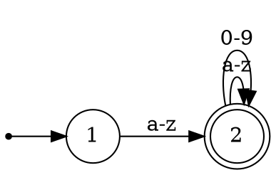

# LP Quiz 3

## 1. Briefly explain the compiler's scanner works?

Convert the source program to serias of tokens.

## 2. Give an example of 5 tokes.

'=', '+', 'if', '3.14', '"STRING EXPR"'

## 3. What is the general approach for the scanner to recognize a token?

Finite Automata.

## 4. What are regular definitions?

Regular expressions associated with suitable names.

## 5. Write an automaton for the regular expression `[a-z][a-z0-9]*`.



## 6. What is the general approach for writing a scanner?

The construction is done automatically by a tool such as the Unix program *Lex*.

## 7. Briefly explain how to use Lex for scanner writing?

Write a lex program, explaining the definitions for each tokens, and pass it to *Lex* then it outputs the scanner program in C.

## 8. Search the Internet for any Lex program and compile and run it. Show its running to the TA and also submit a report to explain about it.

```lex
%{
#include <stdio.h>
%}

%%
" "     ;
[+\-*/] printf("OPERATOR\n");
[0-9]+  printf("NUMBER\n");
\(      printf("OPEN PAREN\n");
\)      printf("CLOSE PAREN\n");
%%

int main() {
  yylex();
  return 0;
}

int yywrap() {
  return 0;
}

int yyerror() {
  printf("Error\n");
  exit(1);
}
```


It lexically analyzes the arthmetic expression and prints each token types.